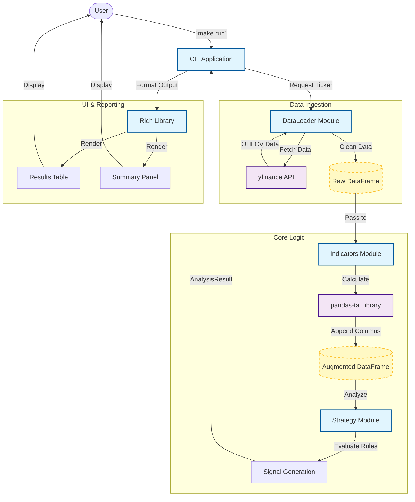

# Project: Mini Market Analyzer

## 1. Project Summary
The **Mini Market Analyzer** is a CLI tool that downloads financial data, calculates technical indicators, and shows them in the terminal. It helps you quickly check the state of a stock (Price, RSI, MACD, Trend) without leaving your command line.

## 2. System Architecture

The system is a simple Python application that uses:
1.  **yfinance**: To get the data.
2.  **pandas-ta**: To calculate indicators.
3.  **Rich**: To make the terminal output look nice (tables, colors).
4.  **plotext**: To draw charts in the terminal.

### 2.1 How it works
1.  You type a ticker (e.g., `analyze AAPL`).
2.  The app downloads the last 2 years of data.
3.  It calculates indicators like EMA and RSI.
4.  It checks a few rules (e.g., is price above EMA 200?) to give a "Signal".
5.  It prints a summary table and optionally a chart.

### 2.2 Data Flow Architecture



## 3. Technology Stack

| Component | Technology | Justification |
| :--- | :--- | :--- |
| **Language** | Python 3.10+ | Industry standard for quantitative finance. |
| **Data Manipulation** | Pandas, NumPy | High-performance time-series analysis. |
| **Technical Analysis** | pandas-ta | Python-native, easy integration with Pandas. |
| **Data Source** | yfinance | Reliable wrapper for Yahoo Finance API. |
| **LLM Integration** | google-genai | Official SDK for accessing Gemini 2.5 Flash. |
| **CLI Framework** | Typer | Modern, type-safe CLI creation. |
| **Visualization** | Plotext / Rich | Terminal-based charting and rich text formatting. |
| **Testing** | Pytest | Standard testing framework. |

## 4. Module Specification

### 4.1 Data Ingestion (`src/data_loader.py`)
*   **Responsibility**: Fetch historical market data.
*   **Key Functions**:
    *   `fetch_data(ticker: str, period: str, interval: str) -> pd.DataFrame`
*   **Error Handling**: Retry logic for API rate limits and connection errors.

### 4.2 Technical Analysis (`src/indicators.py`)
*   **Responsibility**: Compute technical indicators.
*   **Key Indicators**:
    *   **Trend**: EMA, MACD.
    *   **Momentum**: RSI.
    *   **Volatility**: Bollinger Bands, ATR.
*   **Implementation**: Batch computation using `pandas-ta`.

### 4.3 Signal Engine (`src/strategy.py`)
*   **Responsibility**: Classify market regime and generate signals.
*   **Logic**:
    *   **Regime**: Bullish/Bearish/Sideways.
    *   **Signal**: Buy/Sell/Hold based on indicator confluence.
*   **Output**: `AnalysisResult` dataclass with metrics and signal enum.

### 4.4 LLM Analyzer (`src/gemini_analyzer.py`)
*   **Responsibility**: Generate natural language market commentary.
*   **Model**: **Gemini 2.5 Flash** (via `google-genai` SDK).
*   **Input**: Technical indicators summary, current signal, and recent price action.
*   **Output**: 2-sentence explanation of why the signal was generated.
*   **Configuration**: Reads `GEMINI_API_KEY` from `.env` file using `python-dotenv`.
*   **Input**: Technical indicators summary, current signal, and recent price action.
*   **Prompt Strategy**: Context-aware prompting to explain *why* a signal was generated (e.g., "RSI is diverging while price makes new highs...").

### 4.5 CLI Application (`main.py`)
*   **Responsibility**: User interaction and display.
*   **Commands**:
    *   `interactive`: Starts a persistent REPL session (default).
    *   `analyze <ticker>`: Runs analysis and prints a rich report.
    *   `chart <ticker>`: Displays a high-res terminal candlestick chart.
    *   `popular`: Lists common tickers.

## 5. Setup & Workflow

This project uses **uv** for fast, modern Python project management.

### 5.1 Prerequisites
*   **uv**: `curl -LsSf https://astral.sh/uv/install.sh | sh`

### 5.2 Project Initialization
1.  **Clone & Setup**:
    ```bash
    git clone <repo-url>
    cd mini-market-analyzer
    uv sync
    ```
    This command creates the virtual environment and installs all dependencies (including dev tools) defined in `pyproject.toml`.

### 5.3 Development Commands
*   **Activate Environment**: `source .venv/bin/activate`
*   **Run Analysis**: `uv run python -m mini_market_analyzer.main analyze AAPL`
*   **Run Tests**: `uv run pytest`
*   **Add Dependency**: `uv add <package>`

## 6. Implementation Plan

### Phase 1: Foundation & Data
- [x] Initialize project with `uv` and `pyproject.toml`.
- [x] Implement `data_loader` with `yfinance`.
- [x] Create basic CLI structure with `Typer`.

### Phase 2: Core Logic & Indicators
- [x] Implement `indicators` module using `pandas-ta`.
- [x] Develop `strategy` logic for regime classification.
- [x] Unit test indicator calculations.

### Phase 3: Interactive Dashboard & Visualization
- [x] Implement `interactive` REPL loop.
- [x] Build rich terminal output using `Rich` (tables, panels).
- [x] Implement `chart` command with `plotext` (candlesticks).

### Phase 4: Visual Polish & Fixes
- [x] Polish chart rendering (candlesticks, no grid).
- [x] Fix ANSI rendering issues with `Rich`.

### Phase 5: Gemini Integration
- [x] Set up `google-genai` client and API key handling.
- [x] Implement `gemini_analyzer` to generate text summaries from data.
- [x] Configure `.env` file support with `python-dotenv`.
